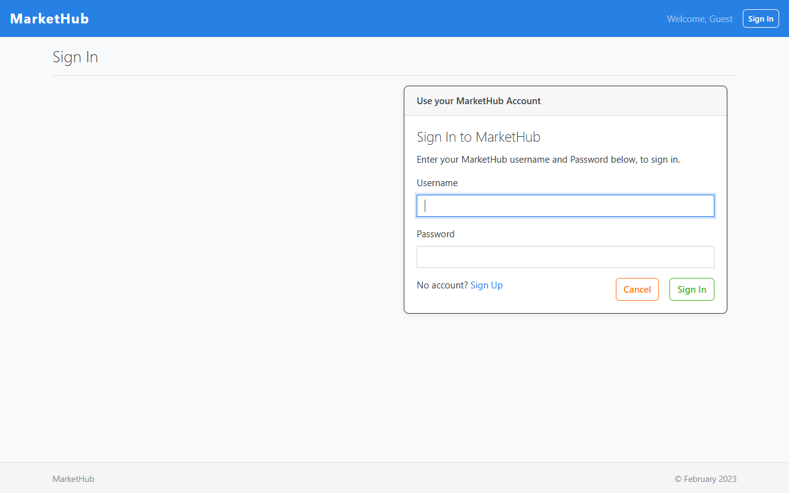
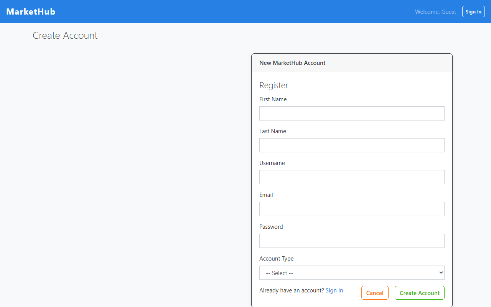
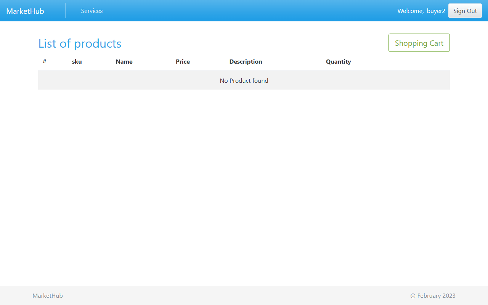
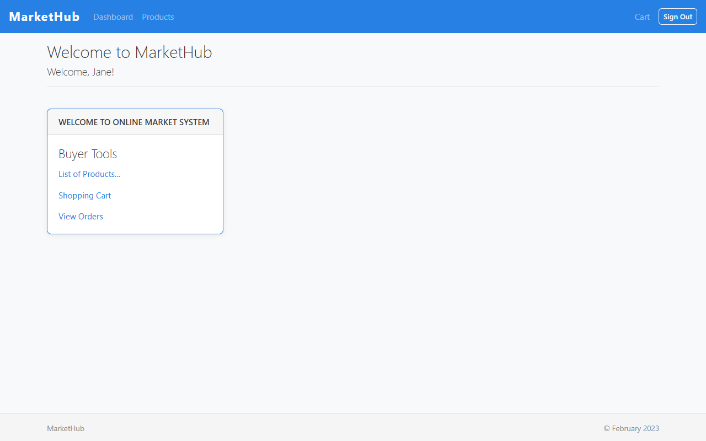
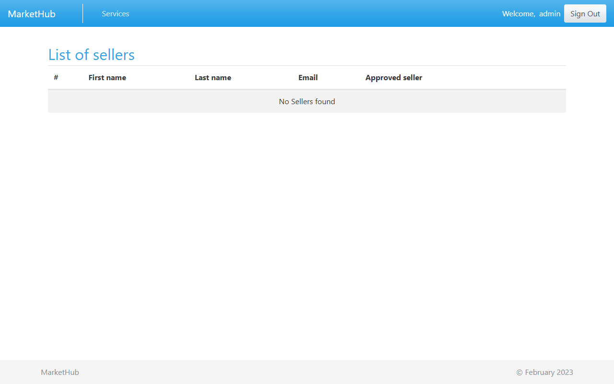

# CS425 Online Market System


A full-stack e-commerce web application built with Spring Boot. Supports three roles — Admin, Seller, and Buyer — with product listings, shopping cart, order management, payments, and reviews.

## Screenshots

| Login | Sign Up |
|-------|---------|
|  |  |

| Product Listing | Seller Dashboard |
|-----------------|-----------------|
|  |  |

| Shopping Cart | Admin Panel |
|--------------|-------------|
|  |  |

## Tech Stack

| Layer | Technology |
|-------|-----------|
| Backend | Spring Boot 2.6.3, Java 17 |
| ORM | Spring Data JPA + Hibernate |
| Security | Spring Security + Spring Session |
| Frontend | Thymeleaf, HTML5, CSS |
| Database | MySQL 8.0 |
| Build | Maven 3.x |

## Features

- **Auth & Authorization** — role-based access (ADMIN, SELLER, BUYER)
- **Product Management** — sellers create/manage products with SKU, price, quantity
- **Shopping Cart** — add items, update quantities, checkout
- **Order Management** — place orders, track status
- **Payments** — multiple payment types supported
- **Reviews** — buyers leave product reviews
- **User Management** — admin approves sellers, manages accounts
- **Address Management** — multiple address types per user

## Prerequisites

- Java 17+
- MySQL 8.0+
- Maven 3.x (or use included wrapper)

## Setup

### 1. Database

Create the database in MySQL:

```sql
CREATE DATABASE `cs425-swe-online-market-db`;
```

### 2. Configure credentials

Edit `src/main/resources/application.properties`:

```properties
spring.datasource.username=YOUR_MYSQL_USERNAME
spring.datasource.password=YOUR_MYSQL_PASSWORD
```

### 3. Run

```bash
# Windows
mvnw.cmd spring-boot:run

# Mac/Linux
./mvnw spring-boot:run
```

App runs at `http://localhost:8081`

## Project Structure

```
src/main/java/.../
├── controller/     # 10 MVC controllers
├── model/          # 10 JPA entities
├── repository/     # 7 JPA repositories
├── service/        # 9 service interfaces + implementations
├── dto/            # 5 data transfer objects
├── config/         # Spring Security configuration
└── constants/      # RoleType, PaymentType enums

src/main/resources/
├── templates/      # 20+ Thymeleaf views (public + role-secured)
└── static/css/     # Stylesheets
```

## Roles

| Role | Capabilities |
|------|-------------|
| ADMIN | Manage all users, approve sellers, full access |
| SELLER | Create/manage own products, view orders for their products |
| BUYER | Browse products, manage cart, place orders, write reviews |

## Default Port

`8081` — configurable via `server.port` in `application.properties`
