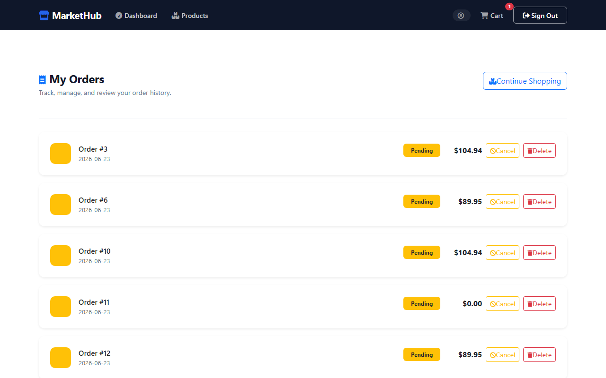

# MarketHub


A full-stack e-commerce web application built with Spring Boot. Supports three roles — Admin, Seller, and Buyer — with product listings, shopping cart, order management, payments, and reviews.

## Tech Stack

| Layer | Technology |
|-------|-----------|
| Backend | Spring Boot 3.3.6, Java 17 |
| ORM | Spring Data JPA + Hibernate |
| Security | Spring Security + Spring Session |
| Frontend | Thymeleaf, Bootstrap 5.3, Font Awesome 6 |
| Database | MySQL 8.0 |
| Build | Maven 3.x |

## Features

- **Auth & Authorization** — role-based access (ADMIN, SELLER, BUYER)
- **Product Management** — sellers create/manage products with SKU, price, quantity
- **Shopping Cart** — add items, update quantities, checkout
- **Order Management** — place orders, track status
- **Payments** — multiple payment types supported
- **Reviews** — buyers leave product reviews
- **User Management** — admin approves sellers, manages accounts
- **Address Management** — multiple address types per user

## Screenshots

| Sign In | Create Account |
|---------|----------------|
|  |  |

| Home | Buyer Dashboard |
|------|-----------------|
|  |  |

| Product Catalogue | Shopping Cart |
|-------------------|---------------|
|  |  |

| Admin Dashboard | User Management |
|-----------------|-----------------|
|  |  |

| My Orders | |
|-----------|--|
|  | |

## Demo Credentials

Seeded automatically on first run:

| Role | Username | Password |
|------|----------|----------|
| Admin | `admin` | `password` |
| Seller | `seller` | `password` |
| Buyer | `buyer` | `password` |

## Quick Start (Docker)

```bash
docker compose up --build
```

App starts at `http://localhost:8081`. MySQL data persists in a named volume.

## Prerequisites

- Java 17+
- MySQL 8.0+
- Maven 3.x (or use included wrapper)

## Setup

### 1. Database

Create the database in MySQL:

```sql
CREATE DATABASE markethub_db;
```

### 2. Configure credentials

Edit `src/main/resources/application.properties`:

```properties
spring.datasource.username=YOUR_MYSQL_USERNAME
spring.datasource.password=YOUR_MYSQL_PASSWORD
```

### 3. Run

```bash
# Windows
mvnw.cmd spring-boot:run

# Mac/Linux
./mvnw spring-boot:run
```

App runs at `http://localhost:8081`

## Project Structure

```
src/main/java/.../
├── controller/     # 10 MVC controllers
├── model/          # 10 JPA entities
├── repository/     # 7 JPA repositories
├── service/        # 9 service interfaces + implementations
├── dto/            # 5 data transfer objects
├── config/         # Spring Security configuration
└── constants/      # RoleType, PaymentType enums

src/main/resources/
├── templates/      # 20+ Thymeleaf views (public + role-secured)
└── static/css/     # Stylesheets
```

## Roles

| Role | Capabilities |
|------|-------------|
| ADMIN | Manage all users, approve sellers, full access |
| SELLER | Create/manage own products, view orders for their products |
| BUYER | Browse products, manage cart, place orders, write reviews |

## API Docs

Swagger UI available at `http://localhost:8081/swagger-ui.html` after startup.

OpenAPI JSON: `http://localhost:8081/v3/api-docs`

Health check: `http://localhost:8081/actuator/health`

## Default Port

`8081` — configurable via `server.port` in `application.properties`

## Technical Overview

See [PROJECT.md](PROJECT.md) for architecture, design decisions, domain model, and testing details.
